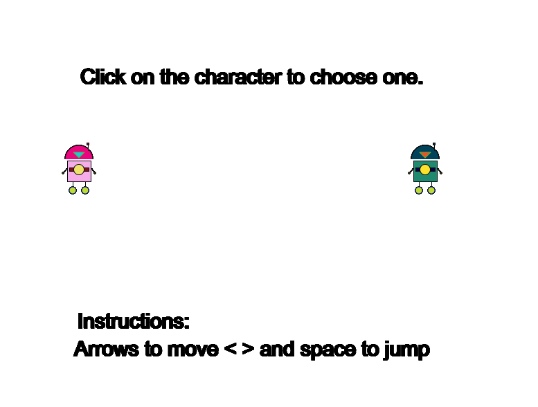
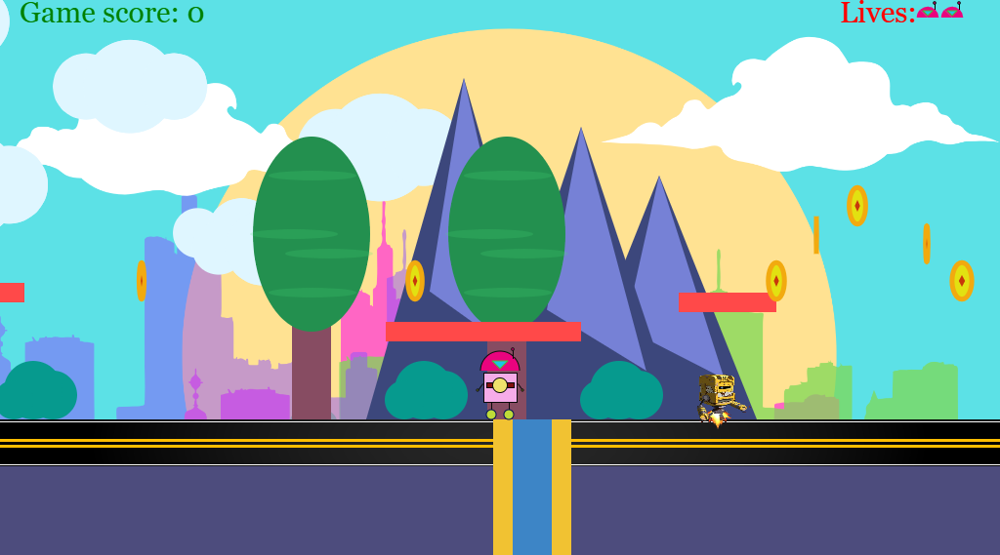
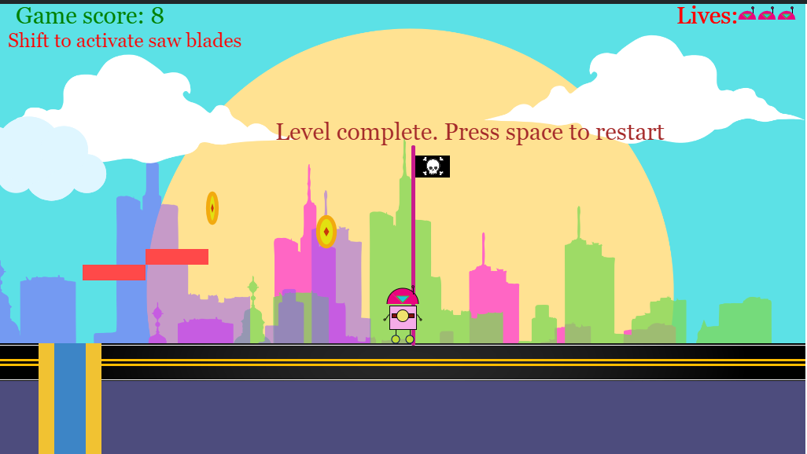

  <h1>Classic-game-in-p5js</h1>
  <h2>Robot Rampage</h2>
  
A classic action-packed game where you control a robot determined to reach the endpoint. Navigate through a challenging terrain, overcome obstacles, and battle against enemy robots to reach the finish line.

  <h3>Objective</h3>
  <ul>
    <li>Reach the endpoint while avoiding obstacles and enemy robots</li>
    <li>Fight against enemy robots to clear your path</li>
    <li>Overcome challenges to emerge victorious</li>
  </ul>
  <h3>Gameplay</h3>
  <ul>
    <li>Use W, A, S, D to move your robot</li>
    <li>Jump to avoid obstacles and attack enemies</li>
    <li>Collect coins to unleash your robot's abilities</li>
  </ul>
  <h3>Features</h3>
  <ul>
    <li>Classic arcade-style gameplay</li>
    <li>Increasing difficulty levels</li>
    <li>Variety of obstacles and enemy robots</li>
    <li>Power-ups and upgrades</li>
  </ul>
  <h3>Built with</h3>
  
p5js library

  
  
  

.image-gallery {
  display: flex;
  flex-wrap: nowrap;
  justify-content: center;
}

.image-gallery img {
  width: 200px; /* Set a uniform width */
  height: 150px; /* Set a uniform height */
  object-fit: cover;
  margin: 10px;
}
